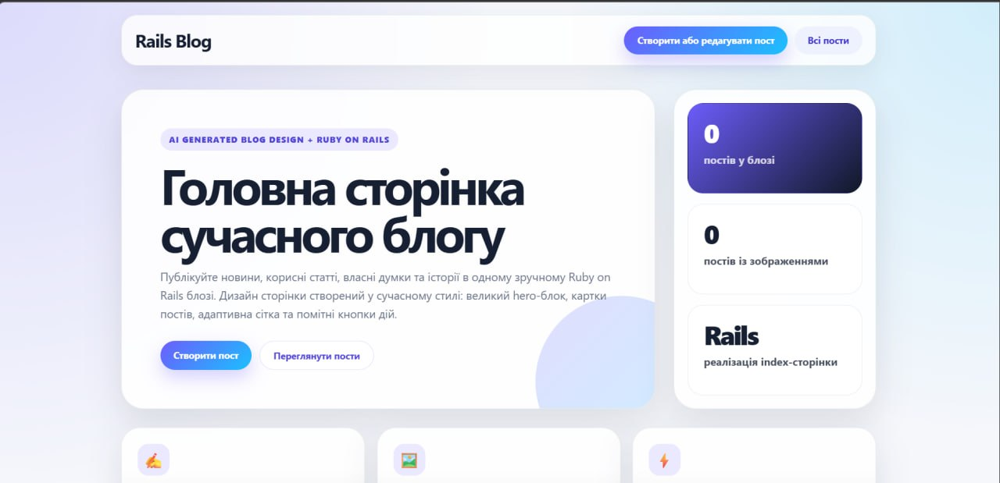
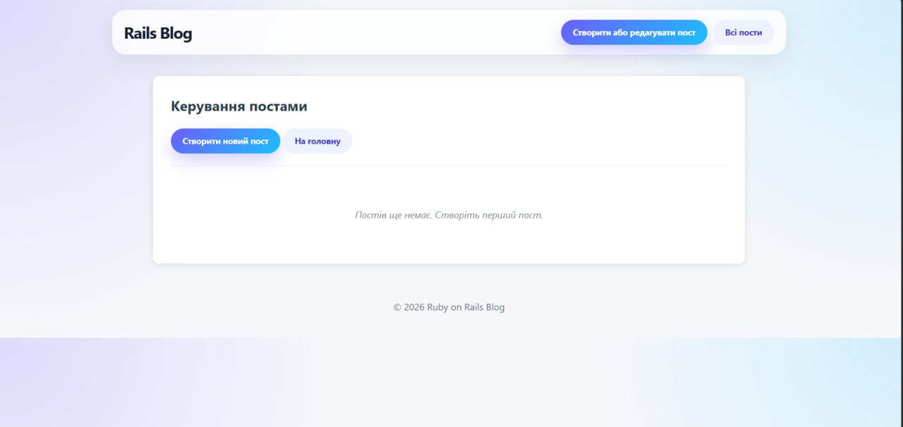
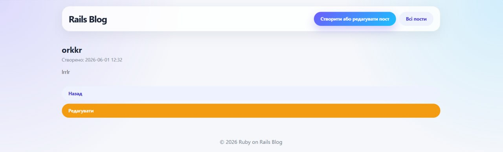
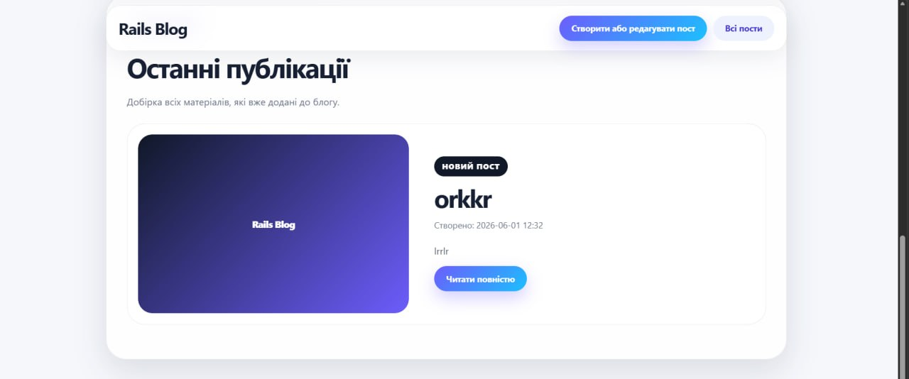

# 🚀 Ruby Blog — AI Design + Ruby on Rails

Сучасний блог з AI-дизайном, реалізований на Ruby (Sinatra) + Ruby on Rails.

## 🖼️ Скріншоти






## 🛠️ Технології

- Ruby + Sinatra
- Ruby on Rails
- ERB шаблони
- CSS3 (градієнти, анімації)
- SQLite3 (Rails версія)

## ⚡ Запуск (Sinatra версія)

1. Встанови залежності:
````bundle install```

2. Запусти сервер:
```ruby start_server.rb```

3. Відкрий браузер: http://localhost:4567

## 🚂 Запуск (Rails версія)

1. Перейди в папку: ```cd rails_blog```
2. Встанови залежності: ```bundle install```
3. Створи базу даних: ```rails db:create && rails db:migrate```
4. Запусти сервер: ```rails server```
5. Відкрий браузер: http://localhost:3000

## ✅ Функціональність

- Створення та редагування постів
- Перегляд списку постів
- Видалення постів
- Завантаження зображень
- Адаптивний дизайн
```

Після вставки натисни зелену кнопку **Commit changes** внизу сторінки.
